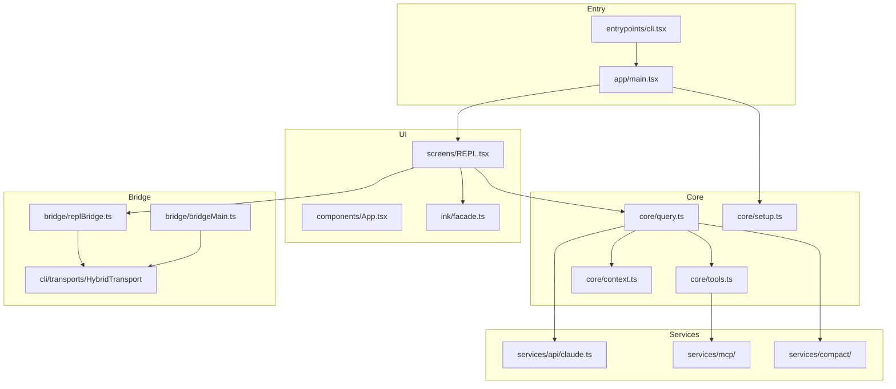

# Claude Code UI — 架构全景

> 本文档覆盖 ~1900 文件的完整架构，目标：读完后可默写复刻核心系统。

---

## 1. 产品定位

**Claude Code** 是 Anthropic 的终端 AI 编程助手 CLI，功能包括：

- 交互式 REPL（终端内 Chat + Tool 执行）
- 斜杠命令系统（`/help`、`/compact`、`/mcp` 等 80+ 命令）
- LLM Tool 编排（Bash、Read、Edit、Agent、MCP…）
- Remote Control 桥接（claude.ai 远程操控本地 session）
- Agent SDK 模式（`-p` 非交互 NDJSON 输出）
- MCP 协议集成、Plugin/Skill 扩展

**技术栈**：Bun 打包 + `feature()` 编译期 DCE、React 19 + React Compiler、自研 Ink 终端 UI、Commander.js CLI、Anthropic SDK、MCP SDK。

---

## 2. 顶层目录地图

| 目录 | 文件数 | 层级 | 职责 |
|------|--------|------|------|
| `src/app/` | 5 | L0 应用 | main.tsx CLI、replLauncher、dialogLaunchers |
| `src/core/` | 11 | L0 核心 | query 循环、Tool 池、context 注入、setup |
| `src/entrypoints/` | 8 | L0 入口 | cli.tsx 最外层 bootstrap |
| `src/utils/` | 564 | L1 基础设施 | 配置、权限、消息、session、git |
| `src/components/` | 389 | L2 UI | Ink 组件、权限对话框、消息列表 |
| `src/commands/` | 207+1 | L2 命令 | 斜杠命令 + registry.ts 注册中心 |
| `src/tools/` | 184 | L2 Tool | LLM 可调 Tool 实现 |
| `src/services/` | 130 | L2 服务 | API、MCP、compact、analytics |
| `src/hooks/` | 104 | L2 React | REPL 桥接、远程 session、快捷键 |
| `src/ink/` | 96+1 | L2 渲染 | Ink fork + facade.ts 公共 API |
| `src/bridge/` | 31 | L2 桥接 | Remote Control / CCR |
| `src/constants/` | 21 | L3 常量 | 系统 prompt、spinner 文案 |
| `src/skills/` | 20 | L3 扩展 | Skill 目录加载 |
| `src/cli/` | 19 | L2 CLI | structuredIO、传输层、handlers |
| `src/state/` | 6 | L2 状态 | AppStateProvider |
| `src/bootstrap/` | 1 | L1 进程 | 全局 session/process 状态 |
| `src/screens/` | 3 | L2 屏幕 | REPL、Doctor、ResumeConversation |
| `src/tasks/` | 12 | L2 任务 | LocalAgent、RemoteAgent、Teammate |
| `src/types/` | 11 | L3 类型 | Command、Message、Permission |
| `src/context/` | 9 | L2 Context | React Context Providers |
| 其余 | ~50 | L3 | vim、voice、buddy、remote、server… |

---

## 3. 进程启动链（必须默写）

```
process.argv
    │
    ▼
entrypoints/cli.tsx          ← 零依赖 fast-path
    │
    ├─ --version / -v          → console.log(MACRO.VERSION)
    ├─ remote-control|bridge   → bridge/bridgeMain.ts
    ├─ daemon                  → daemon/main.js (缺失)
    ├─ ps|logs|attach|kill     → cli/bg.js (缺失)
    ├─ environment-runner      → (缺失)
    ├─ MCP 子进程 flags        → utils/claudeInChrome/mcpServer
    └─ 默认                      → dynamic import app/main.tsx
            │
            ▼
        main() in app/main.tsx
            │
            ├─ init()           entrypoints/init.ts
            ├─ setup()          core/setup.ts
            ├─ Commander 解析 flags
            ├─ getCommands() + getTools() + agents
            └─ launchRepl()     app/replLauncher.tsx
                    │
                    ▼
                App.tsx → REPL.tsx
```

**cli.tsx 设计要点**：几乎所有 import 都是 dynamic，fast-path 只加载必要模块，减少冷启动 ~135ms。

---

## 4. 核心模块详解

### 4.1 Query 循环（心脏）

**文件**：`src/core/query.ts`（~1700 行）

```typescript
async function* query(params: QueryParams): AsyncGenerator<...>
```

**流程**：
1. `processUserInput` 解析用户输入（斜杠命令 / 纯文本 / 附件）
2. 若是 `prompt` 型命令 → 展开 prompt 块，设 `shouldQuery=true`
3. 若是 `local-jsx` 型 → 渲染 Ink UI，不进入 query
4. 进入 `queryLoop`：
   - 调用 `services/api/claude.ts` 流式 API
   - 收到 `tool_use` → `toolOrchestration` 并行/流式执行
   - Tool 结果回注 messages → 继续 loop 直到 stop
   - 自动 compact（上下文压缩）在 token 超限时触发

**SDK 路径**：`src/core/QueryEngine.ts` — class QueryEngine，面向 `-p` / Agent SDK，`submitMessage()` 多轮会话。

### 4.2 Tool 系统

**类型定义**：`src/core/Tool.ts`

```typescript
interface Tool {
  name: string
  description: string
  inputSchema: ToolInputJSONSchema
  execute(input, context): Promise<ToolResult>
  // + permission、progress、UI 等
}

interface ToolUseContext {
  messages, cwd, canUseTool, fileStateCache, ...
}
```

**Tool 池**：`src/core/tools.ts` → `getTools()` / `assembleToolPool()`

**实现目录**：`src/tools/*Tool/`（184 文件）

| Tool | 目录 | 功能 |
|------|------|------|
| BashTool | tools/BashTool/ | 执行 shell 命令 |
| FileReadTool | tools/FileReadTool/ | 读文件 |
| FileEditTool | tools/FileEditTool/ | 编辑文件 |
| AgentTool | tools/AgentTool/ | 子 Agent 委派 |
| SkillTool | tools/SkillTool/ | Skill 执行 |
| WebSearchTool | tools/WebSearchTool/ | 网络搜索 |
| MCP tools | services/mcp/ | 动态 MCP tool |

**权限门控**：`hooks/useCanUseTool.tsx` → `PermissionRequest` UI

### 4.3 命令系统

**注册中心**：`src/commands/registry.ts`（原 commands.ts）

```typescript
const COMMANDS = memoize(() => [
  help, compact, config, mcp, ...
  feature('BRIDGE_MODE') ? bridge : null,
].filter(Boolean))

function getCommands(cwd): Command[] {
  // 合并 builtin + skills + plugins + MCP skills
}
```

**三种命令类型**（`types/command.ts`）：

| 类型 | 行为 | 示例 |
|------|------|------|
| `prompt` | 展开为 prompt 块交给 LLM | insights, review |
| `local` | 纯 TS 逻辑 | commit, status |
| `local-jsx` | 渲染 Ink UI | help, config, doctor |

**命令模块结构**：
```
commands/help/
  index.ts      ← { type, name, load: () => import('./help.js') }
  help.tsx      ← 实际 UI/逻辑
```

### 4.4 UI 层

**Ink 公共 API**：`src/ink/facade.ts`（原 ink.ts）

- 包装 `ThemeProvider`，所有 render 自动带主题
- 导出 Box、Text、useInput、createRoot 等

**App 壳**：`components/App.tsx`

```
FpsMetricsProvider
  └─ StatsProvider
       └─ AppStateProvider
            └─ MailboxProvider
                 └─ VoiceProvider (feature-gated)
                      └─ REPL
```

**主屏幕**：`screens/REPL.tsx`（~5000 行）

- 消息流 VirtualMessageList
- PromptInput 输入框
- 直接 `import { query } from '../query.js'`
- useReplBridge / useRemoteSession / useDirectConnect

### 4.5 Bridge / Remote Control

**Server 模式**：`bridge/bridgeMain.ts`
- 注册 environment 到 claude.ai API
- spawn 子 claude 进程（headless/SDK 模式）
- poll work queue

**Client 模式**：`hooks/useReplBridge.tsx`
- REPL 运行时连接 bridge
- HybridTransport（WebSocket 上行 + SSE 下行）
- 入站消息 → messageQueueManager.enqueue

```
Web UI (claude.ai)
    │ inbound SDKMessage
    ▼
HybridTransport
    │ inject queue
    ▼
REPL.tsx → query loop
    │ outbound messages
    ▼
HybridTransport → Web UI
```

### 4.6 Services 层

| 子目录 | 职责 |
|--------|------|
| `services/api/` | Anthropic API 流式调用、retry、errors |
| `services/mcp/` | MCP 连接、registry、elicitation |
| `services/compact/` | 上下文压缩、microcompact、reactive |
| `services/analytics/` | GrowthBook feature flags、Datadog |
| `services/oauth/` | OAuth 认证流程 |
| `services/lsp/` | LSP client、diagnostics |

### 4.7 状态管理

**进程级**：`bootstrap/state.ts`
- sessionId、cwd、cost、model override
- 注释明确：不要再加 state

**UI 级**：`state/AppState.tsx` + `AppStateStore.ts`
- 权限模式、MCP 状态、bridge 开关、messages

**持久化**：`utils/sessionStorage.ts` — transcript 存盘

---

## 5. 端到端数据流

### 5.1 用户提交 → LLM → Tool

```
PromptInput.onSubmit
    → handlePromptSubmit
    → processUserInput (解析 /command)
    → createUserMessage
    → query() generator
    → API streaming (claude.ts)
    → tool_use blocks
    → toolOrchestration / StreamingToolExecutor
    → tools/* execute
    → tool_result → messages
    → loop until stop_reason
    → setMessages (AppState)
    → VirtualMessageList render
```

### 5.2 SDK / Print 模式

```
claude -p "prompt"
    → cli/print.ts
    → QueryEngine.submitMessage() 或 query()
    → stdout NDJSON SDKMessage
    → cli/transports/ 与 remote runner 通信
```

### 5.3 Context 注入

`src/core/context.ts`：
- `getSystemContext()` — git status、CLAUDE.md、memdir
- `getUserContext()` — 用户环境信息
- 在 query 前 prepend/append 到 messages

---

## 6. 关键类型（必须掌握）

```typescript
// types/command.ts
type Command = CommandBase & (PromptCommand | LocalCommand | LocalJSXCommand)

// types/message.ts
type Message = UserMessage | AssistantMessage | SystemMessage | ProgressMessage | ...

// core/Tool.ts
type Tool, ToolUseContext, CanUseToolFn

// core/query.ts
type QueryParams { messages, tools, commands, canUseTool, ... }

// QueryEngine.ts
type QueryEngineConfig { /* SDK 依赖注入 */ }

// bridge/types.ts
type BridgeConfig, WorkSecret, SpawnMode

// state/AppStateStore.ts
type AppState { permissionMode, mcpServers, bridgeEnabled, ... }

// types/permissions.ts
type PermissionMode = 'default' | 'plan' | 'bypassPermissions' | ...
type PermissionResult
```

---

## 7. 架构模式（复刻清单）

### 7.1 Feature Gating（Bun DCE）

```typescript
import { feature } from 'bun:bundle'

const voiceCommand = feature('VOICE_MODE')
  ? require('./commands/voice/index.js').default
  : null
```

编译期剔除未启用 feature 的代码路径。内外部版本通过 `USER_TYPE === 'ant'` 区分。

### 7.2 懒加载破环

- 命令 `load: () => import('./help.js')`
- replLauncher 动态 import App/REPL
- main.tsx 对 teammate 模块 lazy require
- tools.ts 对 TeamCreate 用 require() 破循环依赖

### 7.3 Transport 抽象

```
cli/transports/
  WebSocketTransport.ts   — 双向 WS
  SSETransport.ts         — 服务端推送
  HybridTransport.ts      — WS 上行 + SSE 下行
  ccrClient.ts            — CCR API client
```

工厂：`getTransportForUrl(url, headers, sessionId)`

### 7.4 向后兼容 Shim

工程化后 `src/*.ts` 根文件为薄重导出：

```typescript
// src/query.ts
export * from './core/query.js'
```

外部 1900+ 文件的 import 路径无需修改。

---

## 8. 构建系统

原版使用 **Bun bundle**：
- 入口：`entrypoints/cli.tsx`
- `feature('XXX')` 编译期常量
- `MACRO.VERSION` 内联
- React Compiler 输出（`_c` 缓存函数）
- 源码含 base64 inline source map

当前工程化版本提供 `package.json` + `tsconfig.json` 脚手架，完整构建需配置 feature flags 矩阵。

---

## 9. 缺失模块（本快照局限）

被引用但不在树中：
- `daemon/main.js` — daemon 子命令
- `environment-runner/main.js`
- `self-hosted-runner/main.js`
- `cli/bg.js` — ps/logs/attach/kill

---

## 10. 最小复刻路径

若要从零复现，按此顺序：

1. **Entry** — 薄 cli.tsx fast-path + 厚 main.tsx Commander
2. **Init** — init() → setup() → trust/auth
3. **UI** — Fork Ink + ThemeProvider + REPL 屏幕 + AppState
4. **Commands** — 三种类型 + registry + slash 解析
5. **Query** — processUserInput → query() generator → API stream
6. **Tools** — Tool 接口 + permission gate + 3 个基础 tool
7. **Services** — api/claude.ts 流式调用
8. **Bridge**（可选）— transport + REPL hook 双向同步
9. **Build** — Bun bundle + feature flags

---

## 11. 模块依赖图


