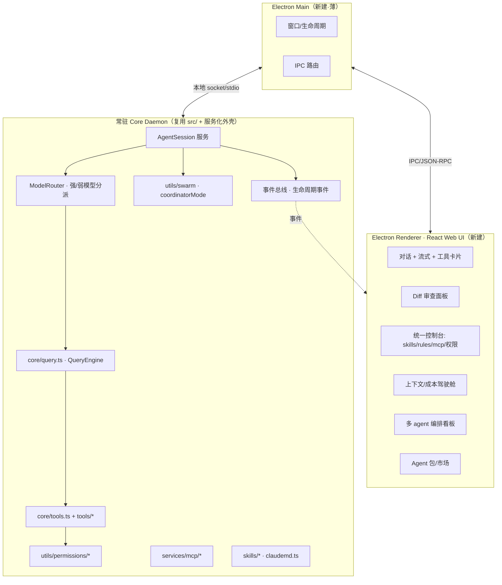
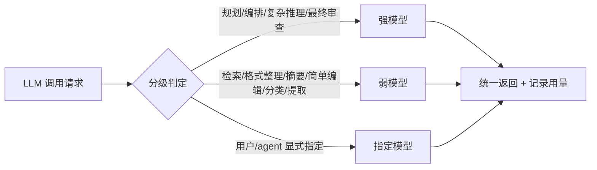

# CCui GUI 设计计划（Electron 桌面端）

> 状态：方案设计（讨论已定方向，待评审后进入 M0 实现）
> 形态：Electron 桌面 App ｜ 目标：开源产品 ｜ 引擎策略：该复用复用、该升级升级

---

## 0. 一句话定位

**不是又一个 AI 聊天框，而是"指挥多个 agent、改动可信可审、且能无限扩展"的编码驾驶舱。**

三支柱（对应 2026 市场三大主线）：

1. **编排**：编排 N 个 agent + 把 skill/rules/MCP/权限/上下文/成本摊在台面上（现有 `src/` 已有 swarm/coordinator 引擎，只是没产品化）。
2. **可信**：每段改动可审查、可溯源、可观测——直击 2026 头号痛点"84% 在用、只有 29% 信任所出"。
3. **可扩展平台**：不是封闭 App，是可被任意插件/agent/UI 扩展的底座（接 Live2D 全局助手、自研 Unity 专属 agent、自定义启动与 UI 都靠这层）。

---

## 1. 问题归类（动手前的形式化，避免错类修复）

| 用户现象 | 真实代码现状 | 问题类型 | 对策层级 |
|---|---|---|---|
| 识别不准文件 | Glob/Grep/Read + 路径纠错 + `@`索引，无语义层 | 缺能力 | 加索引/语义层（M3）|
| 多 agent 不协作 | 有 `AgentTool`/`TeamCreateTool`/`swarm`/`coordinatorMode`，默认关、无 UI | 没产品化 | 编排台 + 默认开（M4）|
| 无控制台开关 | `/skills` `/mcp` `/permissions` 分散 TUI；Rules 无面板 | 碎片化 | 统一控制台（M2）|
| 权限开关不便 | 有规则+弹窗+PermissionMode，缺集中 toggle | 缺集中开关 | 权限驾驶舱（M2）|
| 多人不能协作 | bridge/remote/swarm 需账号+feature | 缺能力 | 协作层（M6）|
| 自定义低 / 不模块化 | 代码已分层；缺的是**面向用户的可视化装配** | 归类升级 | 这正是 GUI 的核心价值 |
| agent 难分享 | `.claude/agents/` + loader，无打包/市场 | 缺能力 | Agent 包 + 市场（M5）|

补充的市场级痛点：冷启动 1–3 分钟、无 diff 审查、无成本/上下文可视、会话不可检索、工具执行黑盒。

用户追加的两点（已纳入）：

| 用户现象 | 真实代码现状 | 问题类型 | 对策层级 |
|---|---|---|---|
| 能自我反思、从错误学习 | 有 `claudemd.ts` 读 CLAUDE.md，但**只读不自写**，错误不沉淀 | 缺能力 | 记忆与自我改进（M3）|
| 极致自定义（接 Live2D/自研 Unity agent/自定义启动 UI） | 代码模块化但**无插件 SDK、无事件总线、无 UI 插槽** | 缺平台层 | 可扩展平台（M6，接口 M0 预留）|

---

## 1.5 2026 市场信号（设计依据，非拍脑袋）

抓取近期主流报告/社区，提炼出和本项目直接相关的信号：

| 信号 | 数据/出处 | 对我们的指向 |
|---|---|---|
| **信任鸿沟** | 84% 开发者用 AI 编码，仅 29% 信任所产出（State of AI Coding 2026） | 痛点已从"生成"转到"验证/审查/溯源"——这是 M1 可信层的市场依据 |
| **从写代码 → 编排 agent** | "multi-agent coordination" 列为 2026 头号优先级（Anthropic 2026 Agentic Coding Trends） | 编排台（M5）是正确的护城河方向 |
| **AI 是协作者，非全自动** | 开发者仅能"完全委派" 0–20% 任务，需持续人类监督 | human-in-the-loop、guardrails、不确定性信号必须内建 |
| **自我改进靠外部记忆** | AGENTS.md/CLAUDE.md + progress.txt + Ralph loop + "Compound Engineering：每次犯错就更新记忆文件" | M3 记忆系统的成熟范式，可直接落地 |
| **可扩展性已收敛为标准** | MCP + Skills(SKILL.md) + Plugins(marketplace.json) + Hooks(30+ 生命周期事件) + Subagents，跨 Claude Code/Cursor/Codex/Gemini/Copilot/OpenCode 互通 | **不要发明私有格式**，兼容标准能直接吃现有生态（如 geminicli 上 1051 个扩展） |
| **headless client-server 成主流** | `opencode serve`、Codex、Copilot 都走 headless server | 验证我们 daemon 化（M0）方向正确 |
| **可观测性=入场券** | 96% 技术负责人视其为关键资产；OpenTelemetry 成标准 | 项目**已装 `@opentelemetry`**，做 agent 行为遥测可视化几乎零成本 |
| **四大 guardrails** | 权限范围(least-privilege)、溯源(provenance)、不确定性信号、最小权限（arXiv 22 systems 调研） | 直接定义 M1/M2 的设计清单 |

---

## 2. 总体架构

三层进程模型，**核心逻辑全部复用 `src/`，只新建 UI 与服务化外壳**。

### 复用 vs 新建 边界（"当断则断"）

| 模块 | 决策 | 理由 |
|---|---|---|
| `core/query.ts`、`QueryEngine`、`tools/*` | **复用** | 业务核心，零重写 |
| `utils/permissions/*`、`services/mcp/*`、`skills/*`、`claudemd.ts` | **复用** | loader 直接暴露成 API |
| `utils/swarm`、`coordinatorMode`、`AgentTool` | **复用 + 解除 feature gate** | 编排台的引擎 |
| Ink UI（`screens/`、`components/`、`ink/`） | **不复用（新建 DOM 版）** | Ink 是终端渲染器，无法搬到浏览器 DOM |
| `hooks/useCanUseTool.tsx`（Ink 弹窗） | **升级** | 权限请求改为 IPC 往返到前端弹窗 |
| 冷启动链路（warm-repl-cache 等） | **升级为 daemon** | 常驻进程，秒开 |

---

## 2.5 模型分级路由 ModelRouter（核心机制·框架一等公民）

**目标**：发挥强模型能力的同时，把简单任务交给弱模型——省钱、提速，且和"编排"天然契合（强模型协调、弱模型执行）。

| 维度 | 设计 |
|---|---|
| **判定依据** | 任务类型标签 + 预估复杂度 + 上下文大小 + 成本预算 + 用户/agent 覆盖 |
| **挂载点** | `query()` 调 API 前加 router 层；子 agent 各带 `model` 配置（`AgentTool` 本就支持 per-agent model）|
| **与编排契合** | `coordinatorMode`：协调者=强模型、worker=弱模型，权限/模型双分级 |
| **可观测** | 每次调用记录"用了哪个模型 + 成本"，进 5.10 驾驶舱 |
| **可自定义** | 路由规则在控制台可视化编辑（呼应高度自定义）；支持"全用强/全用弱/自动"三挡兜底 |
| **复用** | 项目已支持多模型形状（DeepSeek `flash`/`pro`、Anthropic 等）|

**降级与安全**：弱模型产出若被高风险判定（动钱/schema/删除）或置信度低，自动升级到强模型复核（接 5.9 不确定性信号）。

---

## 3. 后端 headless 化（把 TUI 引擎变成服务）

核心新增一个 `AgentSession` 服务，把现有 `query()` 包成事件流：

- **输入**：`sendMessage(sessionId, text|command)`
- **输出（事件流）**：`assistant_delta`、`tool_use`、`tool_result`、`permission_request`、`diff_proposed`、`usage`(token/cost)、`done`
- **权限**：`canUseTool` 不再渲染 Ink，而是发 `permission_request` 事件 → 前端弹卡片 → 回 `permission_response`
- **管理 API**：`listSkills/toggleSkill`、`listMcp/enable/disable/reconnect`、`listRules`、`getPermissions/setPermissionRule`、`listAgents`

这一层是**所有 GUI 功能的地基**，M0 必须先打通。

---

## 4. 前端技术栈

- Electron + React + TypeScript + Vite
- 状态：Zustand（轻）｜ 样式：Tailwind ｜ diff：`diff`(已在依赖) + Monaco/CodeMirror 渲染
- IPC：Electron `ipcRenderer` ↔ Main ↔ Core(本地 socket)，统一 JSON-RPC 风格
- 设计原则：可视层级清晰、改动可控、上下文透明（见竞品分析）

---

## 5. 功能模块设计要点

### 5.1 Diff 审查 + 驾驶舱（基础体验，竞品标配）
- 工具产生的文件改动以 **diff 卡片** 呈现，逐条 接受/拒绝/全部
- 驾驶舱常驻侧栏：当前加载的 文件 / rules / skills / token 用量 / 累计成本 / 上下文剩余
- 复用：`utils/fileHistory`、`FileEditTool` 的 diff 计算；新增前端渲染

### 5.2 统一控制台（见效最快）
- 一屏四 Tab：Skills / Rules / MCP / Permissions
- 每项：来源标注（内置/项目/全局/插件）+ 启停开关 + 详情
- 关键补强：**读取 `.cursor/rules` / `.cursorrules`**（当前完全不读），统一展示
- 复用：各 loader；新增 toggle 写回 settings

### 5.3 权限驾驶舱
- 模式切换（default/acceptEdits/plan/bypass）一键
- "始终允许：读文件 / Bash / 写文件"快捷 toggle，写回 `permissions.allow`
- 复用：`PermissionMode`、`PermissionUpdate`

### 5.4 文件语义识别（提升单 agent 质量）
- 在现有 FileIndex 之上加 **本地语义索引**（embedding，可选本地/远程）
- 新增 `SemanticSearchTool`：按意图找文件/代码块，弥补"靠猜路径"
- 复用：`hooks/fileSuggestions`、Rust FileIndex；新增向量层

### 5.5 多 agent 编排看板（护城河，最后做因为依赖全部前置）
- 看板：把任务拆给多个子 agent，每个 agent 一列，实时显示"在干嘛/调了什么工具/产出"
- 主控可：派活、暂停、接管、合并结果
- 复用：`utils/swarm`、`coordinatorMode`、`AgentTool`、`SendMessageTool`、`TeamCreateTool`（解除 feature gate）
- 每个子 agent 复用 5.1–5.3 的 diff/权限/上下文

### 5.6 Agent 打包 / 分享 / 市场（编排成型后才有意义）
- **修正：不发明私有 `.agent` 格式**，改为兼容 2026 既成标准——`marketplace.json` 目录 + `plugin.json` 清单 + `SKILL.md` + hooks，使别人的插件能装进来、我们的也能被别的工具消费
- 一个插件包 = agent 定义 + 关联 skills + `.mcp.json` 依赖 + hooks + 元数据
- 一键 导入/导出/校验依赖；本地市场浏览 + `/plugin marketplace add <git-url>`
- 复用：`loadAgentsDir`、`services/mcp`、`skills/loadSkillsDir`；新增打包器 + 安装器 + 兼容层

### 5.7 记忆与自我改进（用户补充 1，市场热点）
- **外部记忆架构**（不靠拉长上下文）：episodic 会话记忆 + reflective 经验库 + 自动维护 `CLAUDE.md`/`AGENTS.md`
- **从错误学习**：每次人工纠正 / 工具失败 / 测试不过 → 提炼"教训"写回记忆文件（Compound Engineering 范式），下次自动注入
- 任务状态持久化（progress / prd 风格），崩溃可续、避免重复劳动
- 可视化"记忆库"面板：看 AI 学到了什么、可编辑/删除（避免脏记忆污染）
- 复用：`claudemd.ts`（现仅读）→ 升级为可写回；新增反思器 + 记忆库 UI

### 5.8 可扩展平台 + 插件 SDK（用户补充 2，平台护城河）
- **事件/Hook 总线**：暴露 agent 生命周期事件（开始/工具调用/产出/出错/结束等 30+ 事件），插件可订阅
- **UI 插槽（slots）**：前端预留可挂载区（侧栏/浮层/状态栏），插件可注入自定义界面——这是"接 Live2D 全局助手""自定义启动 UI"的技术载体
- **插件 SDK**：定义清晰 API（注册工具/命令/面板/订阅事件/调用 core），TS 优先
- **示例插件**（验证平台能力，也是开源宣传素材）：① Live2D 桌宠助手（订阅事件驱动动作）② Unity 专属 agent（专用 skills+mcp）
- 复用：`commands/registry`、`tools/*` 注册机制作为内核；新增 SDK + 事件总线 + 插槽系统
- **架构原则**：M0 就预留这些接口，避免后期大改

### 5.9 信任与审查层（市场头号痛点）
- **溯源(provenance)**：每段改动标注 模型/prompt/工具来源，可追到"这行为什么改"
- **不确定性信号**：agent 对没把握的改动显式标记，引导人审；学会"不确定时求助"而非硬干
- **高风险护栏(guardrails)**：动钱/用户数据/schema/删除 等操作强制人审（blast radius 提示）
- 复用：权限系统 + 审批流；新增溯源元数据 + 风险分类

### 5.10 可观测性（强化版 — 入场券，且项目已装 OTel 近乎白送）

分三层，复用**已装的 `@opentelemetry`**（spans/metrics/logs SDK 都在依赖里）：

**A. 实时驾驶舱（侧栏常驻）**
- **上下文占用条**：按来源分段显示 system / rules / skills / 已读文件 / 历史，谁在吃 context 一目了然；逼近上限高亮预警
- **成本/Token 实时**：本轮 + 累计，按 模型 / agent / 工具 分解
- **活跃态**：当前在调哪个工具、哪个 agent 在跑、排队中的任务

**B. 执行 Trace（OTel span 树，核心差异化）**
- 每轮对话 → 每次工具调用 = 一个 span：耗时、输入输出摘要、成功/失败，可展开下钻
- **会话回放 / time-travel**：滑动到任意步，回看当时的 messages / context / 文件状态（替代"终端黑盒"）
- **多 agent 拓扑图**：谁派给谁、消息流向、各 agent 状态灯（编排台 M5 的可视底座）

**C. 诊断与导出**
- **失败诊断**：错误聚合 + 重试链 + 根因提示（不再是终端里一坨红字）
- **上下文审计**：compact/压缩 何时触发、丢了什么、为什么
- **导出**：OTLP 直推外部 Jaeger/Grafana；trace 存文件，团队可共享分析
- **隐私**：默认本地优先，遥测可一键关

### 5.11 体验（UX）规格（决定留存）

**性能（"舒适"的第一前提）**
- daemon 常驻 → 秒开（干掉 1–3 分钟冷启动）
- 虚拟列表（复用 `VirtualMessageList` 思路）+ 流式渲染不卡 + 随时中断/继续

**导航**
- 多会话标签页 + **会话树/分支**（同一上文派生多条尝试）
- **命令面板（Ctrl/Cmd+K）**：一处直达所有命令/会话/文件/设置
- 键盘优先，全功能可不碰鼠标

**输入**
- `@` 提及文件/符号自动补全（复用现有 Rust FileIndex）
- 拖拽文件/图片进对话；多模态贴图
- **提示词片段库**（常用 prompt 收藏/复用）

**反馈**
- **桌面通知**：任务完成 / 需要审批时弹通知——后台 agent 与编排台尤其关键（"build while you sleep"）
- 进度可视、友好错误（人话 + 可操作建议，而非堆栈）

**编辑与回退**
- 内联 diff、一键应用/撤销（复用 `fileHistory`）
- **工作区检查点（checkpoint）**：整目录快照，一键回滚到任意检查点（超越单文件历史）

- 首启 onboarding + 友好空状态

### 5.12 优化扩充候选池（Backlog，按价值待排）

| 项 | 价值 | 复用 |
|---|---|---|
| **多模型智能路由** | 杂活给便宜模型、难活给强模型 → 省钱提速（2026 热点） | 已支持多模型形状 |
| **成本预算/限额/告警** | 防烧钱失控，团队必需 | 接 5.10 成本数据 |
| **沙箱执行** | 危险命令/不可信代码隔离运行，安全卖点 | **已装 `@anthropic-ai/sandbox-runtime`** |
| **测试反馈闭环** | 自动跑 typecheck/test 把结果喂回 agent（Ralph loop 必需，配合 M3 记忆） | BashTool + M3 |
| **Git 可视化** | diff/stage/commit/PR 一体 | git 集成 |
| **计划模式（plan/act）** | 先出可编辑计划再执行（Cline 范式，降低失控） | 已有 plan permission mode |
| **后台任务队列** | 长任务排队、离线跑、build-while-you-sleep | LocalAgentTask/RemoteAgentTask |
| **Agent 质量 eval** | 让用户验证 agent 好坏，开源信任背书 | — |
| **i18n / a11y** | 国际化与无障碍，开源面向全球 | — |

---

## 6. 里程碑路线图（排期 = 依赖顺序，非随意）

> 排期因果链：**地基(含扩展接口预留) → 可信体验(市场头号痛点，单 agent 也要) → 控制台见效快 → 记忆让 agent 越用越强 → 语义提升定位质量 → 编排台依赖以上每一项 → 平台/分享在内核稳定后开放 → 协作最后。**

| 里程碑 | 内容 | 验收标准 |
|---|---|---|
| **M0 骨架(Walking Skeleton)** | Core daemon + **事件总线** + **ModelRouter(强/弱分派)** + 工具/权限 + Electron 骨架(活动栏 6 区全建) + 各模块预留接口 | 发一句话→流式回复 + 工具调用 + 权限弹窗；**驾驶舱显示本步用了强/弱哪个模型 + 成本**；秒开 |
| **M1 可信体验** | Diff 审查 + 溯源标注 + 不确定性信号 + 上下文/成本驾驶舱 + 基础可观测时间线 | 改动以 diff 卡片可逐条接受/拒绝；每段标来源；侧栏显示 token/成本/工具时间线 |
| **M2 控制台 + 护栏** | Skills/Rules/MCP/权限 统一面板 + 读 `.cursor/rules` + 高风险操作强制人审 | 四类配置可视可开关、来源可见；删/动数据类操作弹强确认 |
| **M3 记忆与自我改进** | 外部记忆 + 自动写回 CLAUDE.md/AGENTS.md + 反思循环 + 记忆库面板 | 纠正一次错误后，同类问题下次不再犯；记忆可查可编辑 |
| **M4 文件语义识别** | 语义索引 + SemanticSearchTool | "找处理登录的文件"命中而非猜路径 |
| **M5 编排台（护城河）** | 多 agent 看板（接管 swarm/coordinator），每个子 agent 复用 M1–M3 | 一个任务拆给 ≥2 agent 并行，实时观察、可接管/合并 |
| **M6 可扩展平台 + 分享** | 插件 SDK + 事件总线 + UI 插槽 + 兼容 plugin.json/marketplace.json/SKILL.md；Live2D/Unity 示例插件 | 第三方插件一键装入并注入自定义 UI；导出的包能被别的工具消费 |
| **M7 协作** | 多人同会话/共享工作区（扩展 bridge/remote） | 两人连同一会话协同 |

### 贯穿性能力（不单列里程碑，逐期加厚）

- **可观测性（5.10）**：M0 起就埋点（OTel 已在），每个里程碑把对应视图补上——M1 成本/上下文条、M5 多 agent 拓扑、全程 trace 树。
- **体验/UX（5.11）**：秒开与流式在 M0；命令面板/标签页/通知在 M1–M2；checkpoint 配合 M3。
- **候选池（5.12）**：沙箱执行、测试反馈闭环优先（直接提升可信与 M3 记忆质量）；多模型路由/成本预算随团队场景排入。

---

## 7. 开源工程化

- 仓库结构建议：根 `src/`(core 引擎) 不动；新增 `apps/desktop/`(electron) 与 `packages/core-service/`(daemon 外壳)
- 必备：LICENSE（建议 MIT/Apache-2.0）、CONTRIBUTING、模块边界文档、M0 可跑 demo
- 多模型可切（已支持 DeepSeek/Anthropic 形状）作为开源卖点之一

---

## 8. 风险与未决

| 风险 | 说明 | 缓解 |
|---|---|---|
| daemon 化改动面 | query 与 Ink/REPL 耦合点需解耦 | M0 先做最小 spike 验证可行性 |
| 语义索引成本 | 本地 embedding 性能/依赖 | M4 提供"可关"，默认轻量 |
| feature gate 解除 | swarm/teams 实验代码稳定性 | M5 前先回归测试现有引擎 |
| 体积 | Electron 包大 | 接受，换生态成熟度 |
| 脏记忆污染 | 自我改进可能写入错误"教训"，越用越歪 | M3 记忆可审计/可编辑/可回滚，关键写回需确认 |
| 插件安全 | 第三方插件能注入 UI/订阅事件，存在恶意风险 | M6 插件最小权限 + 来源校验 + 沙箱化敏感能力 |
| 标准漂移 | plugin/marketplace 标准仍在 preview，可能变 | M6 做薄兼容层隔离，标准变只改适配层 |

**首要技术命门**：M0 的 daemon 化能否干净地把 `query()` 从 Ink 中剥离。建议第一步做一个最小 spike 验证。
