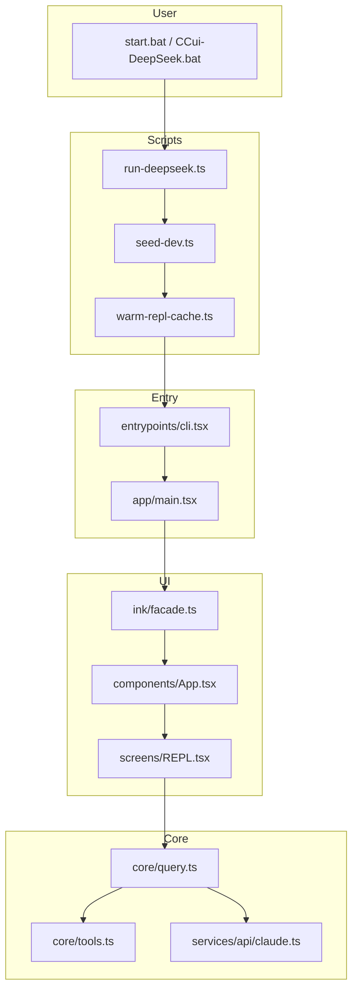

# CCui 项目复刻报告

> **目标读者**：没看过源码的人。读完本文 + 按验收清单跑通，应能在新机器上复现与本仓库等价的可运行工程。  
> **配套文档**：`ARCHITECTURE.md`（架构深读）、`MODULES.md`（模块索引）、`DEV.md`（日常开发命令）。

---

## 1. 这到底是什么

| 维度 | 说明 |
|------|------|
| **产品** | Anthropic **Claude Code** 终端 AI 编程助手（交互 REPL + Tool 执行 + 斜杠命令 + MCP） |
| **本仓库** | 从官方 **Bun 编译产物反编译/提取** 的 TypeScript 源码，再做 **工程化重组**（约 **1934** 个 `src/` 文件） |
| **运行方式** | 开发态用 **Bun 直接跑 `.tsx`**，不是官方单文件 bundle |
| **本 fork 特化** | 接 **DeepSeek**（`ANTHROPIC_BASE_URL` + API Key），跳过 OAuth/引导，带进度条与预热 |

**不是**：官方 npm 包 `@anthropic-ai/claude-code` 的 1:1 替代品；内部 `@ant/*` 原生模块、完整 Skill 正文、daemon 等为 stub 或缺失。

---

## 2. 复刻所需原始素材

要 **100% 文件级复刻** 本仓库，你需要：

1. **完整源码树** — 即当前 `e:\CCui\src\`（~1900 文件）及 `stubs/`、`scripts/`、`docs/`
2. **Bun ≥ 1.1** — 运行时 + `--define MACRO.VERSION=...`
3. **Node ≥ 20** — 部分工具链假设
4. **Git Bash 或 bash** — `BashTool` 默认找 `C:\Program Files\Git\bin\bash.exe`
5. **系统 ripgrep (`rg`)** — 内置 rg 二进制不存在时走回退
6. **API Key** — DeepSeek 或 Anthropic；写入 `.env`

**无法从公开渠道单独下载的部分**（本仓库已用 stub 替代）：

- `@ant/claude-for-chrome-mcp`、`@ant/computer-use-*` 等内部包 → `stubs/`
- 完整 bundled Skill `.md` 正文 → `src/skills/bundled/*Content.ts` 空占位
- `daemon/`、`environment-runner/`、`cli/bg.js` 等子命令实现

---

## 3. 从零复刻：逐步清单

按顺序执行，缺一步都可能卡在启动或 REPL 90%。

### 阶段 A — 脚手架

```powershell
mkdir CCui && cd CCui
# 复制整个 src/ stubs/ scripts/ docs/ package.json tsconfig.json bun.lock
# 复制 .env.example → .env 并填 Key
bun install
bun run bootstrap    # 循环补缺失 npm 包，直到 cli --help 成功
```

### 阶段 B — 必须存在的 Shim / 补丁文件

以下文件 **不存在则必挂**，复刻时逐项核对：

| 文件 | 作用 | 挂掉症状 |
|------|------|----------|
| `src/app/setup.ts` | `export { setup } from '../core/setup.js'` | `main.tsx` 动态 import 永久卡住 |
| `src/setup.ts` | 重导出 `core/setup.ts` | CLI handlers 找不到 setup |
| `src/main.tsx` | `export { main } from './app/main.js'` | cli 无法 load main |
| `src/query.ts` 等根 shim | 重导出 `core/*` | 1900+ 旧 import 路径断裂 |
| `src/utils/filePersistence/types.ts` | 类型 stub | `print.js` 无法加载 |
| `src/tools/TungstenTool/TungstenLiveMonitor.tsx` | 返回 `null` 的 stub | REPL import 失败，卡在 90% |
| `src/utils/ultraplan/prompt.txt` | ultraplan 命令 prompt | REPL import 失败 |
| `src/ink/global.d.ts` | Ink 类型增强 | TS 编译 |
| `src/entrypoints/sdk/*.ts` | SDK 类型 stub | SDK 路径编译 |
| `src/skills/bundled/*Content.ts` | 空 skill 占位 | 启动可过，skill 无内容 |

### 阶段 C — package.json 额外依赖（bootstrap 可能漏的）

除 `package.json` 已列项外，**REPL 冷启动** 曾缺：

- `fuse.js` — `commandSuggestions.ts`
- `qrcode` — 某 UI 命令
- `proper-lockfile` — 配置锁
- `@opentelemetry/sdk-trace-base` — telemetry（失败不致命但会 ERROR 日志）

运行 `bun run bootstrap` 或 `scripts/warm-repl-cache.ts` 直到无 `Cannot find package/module`。

### 阶段 D — 环境变量

`.env` 最小集：

```env
ANTHROPIC_BASE_URL=https://api.deepseek.com/anthropic
ANTHROPIC_API_KEY=sk-...
```

脚本自动注入：

| 变量 | 注入位置 | 含义 |
|------|----------|------|
| `CLAUDE_CODE_DEV=1` | `run-deepseek.ts` / `dev.ts` | 跳过信任/Onboarding/API Key 审批 |
| `CLAUDE_CODE_SIMPLE=1` | `--bare` 或 run-deepseek | 精简模式，少 prefetch |
| `MACRO.VERSION` | Bun `--define` | 编译期版本字符串 `2.0.0-dev` |

### 阶段 E — 启动入口（用户侧）

| 入口 | 用途 |
|------|------|
| `CCui-DeepSeek.bat` / `start.bat` | 双击交互 REPL |
| `start-print.bat` | 单次 `-p` 问答 |
| `scripts/start-terminal.ps1` | 当前 PowerShell 窗口启动 |
| `bun run deepseek -- --bare -p "..."` | 脚本化 print |
| `bun run smoke` | 自动化验收 |
| `bun run verify:repl` | 验收 REPL 到 100% |

### 阶段 F — 验收（必须全绿才算复刻成功）

```powershell
bun run smoke          # 4 项全 ✅
bun run verify:repl    # .ccui-startup-status percent=100
# 人工：双击 CCui-DeepSeek.bat，见进度条到 100% 且可输入
```

---

## 4. 目录结构（必记）

```
CCui/
├── src/                    # 1934 文件，核心源码
│   ├── entrypoints/cli.tsx   # 进程最外层入口（fast-path）
│   ├── app/main.tsx          # Commander + 会话逻辑 (~4600 行)
│   ├── app/replLauncher.tsx  # 懒加载 App + REPL
│   ├── app/interactiveHelpers.tsx  # showSetupScreens / renderAndRun
│   ├── core/                 # query 循环、Tool、setup、context
│   ├── screens/REPL.tsx      # 主 UI (~5000 行)
│   ├── components/           # Ink UI 组件 (~389)
│   ├── commands/registry.ts  # 斜杠命令注册
│   ├── tools/                # LLM Tool 实现 (~184)
│   ├── services/             # API、MCP、compact、analytics
│   ├── ink/                  # 自研终端渲染引擎
│   ├── bridge/               # Remote Control
│   ├── cli/print.ts          # -p 非交互模式
│   ├── utils/                # 配置、权限、session…
│   ├── bootstrap/state.ts    # 进程级 session 状态
│   └── *.ts (根 shim)        # 重导出 core/*，保持旧 import 路径
├── stubs/                    # @ant/* 占位包
├── scripts/                  # 开发/DeepSeek/验收脚本
├── docs/                     # 架构与本报告
├── start.bat                 # Windows 双击入口
├── CCui-DeepSeek.bat         # 同上（别名）
└── package.json
```

**工程化原则**：业务代码进 `app/`、`core/`、`commands/registry.ts`；根目录 `src/query.ts` 等只做 `export * from './core/query.js'`，避免改 1900 处 import。

---

## 5. 启动链路（默写级）

```
用户双击 start.bat
    → scripts/run-deepseek.ts
        → loadDotEnv(.env)
        → seed-dev.ts（信任目录、Onboarding、批准 API Key）
        → warm-repl-cache.ts（预热 App.tsx + REPL.tsx 编译）
        → spawn cli.tsx + 进度条解析 CCUI_PROGRESS:* 行
    → entrypoints/cli.tsx::main()
        → fast-path: --version / bridge / daemon …
        → dynamic import app/main.tsx
    → main.tsx::main()
        → 判定 isInteractive（需 stdout.isTTY，且无 -p）
        → init() / setup()
        → Commander 解析 flags（--bare --model deepseek-v4-flash）
        → action handler:
            → createRoot (Ink)
            → showSetupScreens（DEV 下直接 return）
            → launchRepl → App + REPL
            → renderAndRun → devStartupReady() 写 100%
    → REPL 等待用户输入 → query() → API → Tool
```

**TTY 规则**：

- `stdout.isTTY === false` → 强制非交互，等同 `-p`，会报 `Input must be provided...`
- 交互 REPL **必须**在 CMD / Windows Terminal / Cursor 集成终端跑，不能管道后台

**进度协议**（`src/utils/devStartupProgress.ts`）：

```
stderr: CCUI_PROGRESS:45:初始化会话…
stderr: CCUI_READY
文件:   .ccui-startup-status  → {"percent":100,"label":"REPL 已就绪…"}
```

---

## 6. 五大子系统（复刻核心逻辑）

### 6.1 Query 循环 — `src/core/query.ts`

```
用户输入 → processUserInput（斜杠命令 / 纯文本）
    → query() async generator
    → services/api/claude.ts 流式 API
    → tool_use → tools/* execute → tool_result
    → 循环直到 stop
```

非交互走 `cli/print.ts` + `QueryEngine.ts`。

### 6.2 Tool 系统 — `src/core/Tool.ts` + `src/tools/`

- `getTools()` / `assembleToolPool()` 按 feature 与权限组装
- 每个 Tool：`name`、`inputSchema`、`execute()`、可选 Ink 结果 UI
- 权限：`hooks/useCanUseTool.tsx` → 确认对话框

### 6.3 命令系统 — `src/commands/registry.ts`

| 类型 | 行为 | 例 |
|------|------|-----|
| `prompt` | 展开 prompt 给 LLM | `/review` |
| `local` | 纯 TS | `/commit` |
| `local-jsx` | Ink 界面 | `/help` |

`getCommands(cwd)` = builtin + skills + plugins + MCP commands。

### 6.4 UI — Ink + REPL

```
ink/facade.ts → ThemeProvider 包裹
components/App.tsx → Provider 树
screens/REPL.tsx → 消息列表 + PromptInput + query 驱动
```

React Compiler 产物：组件内 `_c(N)` 缓存函数，**不要**当 bug 删掉。

### 6.5 配置与信任 — `src/utils/config.ts`

- 全局：`~/.claude.json`
- 项目：`.claude/settings.json`
- `checkHasTrustDialogAccepted()` — 交互模式门禁
- **DEV 模式**（`interactiveHelpers.tsx`）：自动信任 + 批准 API Key + 跳过所有 Setup 对话框

---

## 7. DeepSeek 适配层（本 fork 特有）

官方 Claude Code 走 OAuth + Anthropic API。本仓库改为：

```
ANTHROPIC_BASE_URL=https://api.deepseek.com/anthropic
ANTHROPIC_API_KEY=<DeepSeek Key>
--model deepseek-v4-flash   # 或 deepseek-v4-pro
--bare                      # 精简启动
```

| 组件 | 文件 | 行为 |
|------|------|------|
| 环境加载 | `scripts/loadEnv.ts` | 读 `.env`，不覆盖已有 env |
| 开发种子 | `scripts/seed-dev.ts` | 信任 CWD、完成 Onboarding、批准 Key |
| 启动器 | `scripts/run-deepseek.ts` | DEV 变量 + 预热 + 进度条 + spawn cli |
| 轻量问答 | `scripts/deepseek-ask.ts` | 不加载 REPL 的快速问句 |
| 跳过引导 | `interactiveHelpers.tsx` | `CLAUDE_CODE_DEV` 早退 |
| API 客户端 | `services/api/claude.ts` | 仍用 Anthropic SDK 形状，base_url 指向 DeepSeek |

---

## 8. Feature Gating 与构建

原版用 **Bun bundle** + `feature('XXX')` 编译期 DCE：

```typescript
import { feature } from 'bun:bundle'
if (feature('BRIDGE_MODE')) { ... }
```

内外部版本用 `"external" === 'ant'` 字符串比较（编译期常量）。

**开发态**：未 bundle 时 feature 多为 true，代码路径比官方「外部版」更全。

**完整官方构建复刻**还需要：feature 矩阵、`MACRO.*` 注入、React Compiler 流水线 — 见 `scripts/build.ts`（当前仅占位）。

---

## 9. stubs/ 内部包

| 包名 | 路径 | 说明 |
|------|------|------|
| `@ant/claude-for-chrome-mcp` | `stubs/claude-for-chrome-mcp/` | Chrome MCP 空实现 |
| `@ant/computer-use-mcp` | `stubs/computer-use-mcp/` | 计算机使用 MCP |
| `@ant/computer-use-input` | `stubs/computer-use-input/` | 输入设备 |
| `@ant/computer-use-swift` | `stubs/computer-use-swift/` | macOS 原生 |

`package.json` 用 `"file:./stubs/..."` 引用。复刻时必须连同 `stubs/` 一起复制。

---

## 10. 与官方 Claude Code 的差异（无法 100% 等同）

| 能力 | 本仓库 | 官方 |
|------|--------|------|
| 启动速度 | 冷编译 1–3 分钟 | 单 bundle 秒开 |
| OAuth / claude.ai 登录 | DEV 跳过 | 完整 |
| Skill 正文 | 空占位 | 完整 md 树 |
| Computer Use / Chrome MCP | stub | 原生二进制 |
| `claude daemon` / `ps` / `logs` | 缺失模块 | 有 |
| GrowthBook 实验 | 可连网，常 defaults | 生产配置 |
| 版本号 | `2.0.0-dev` 脚本注入 | 正式 semver |

**功能上** 可复刻：交互 REPL、`-p` print、Tool（Bash/Read/Edit…）、斜杠命令、MCP 配置、DeepSeek API。

---

## 11. 端到端数据流（用户提交一条消息）

```
PromptInput.onSubmit
  → handlePromptSubmit
  → processUserInput (/cmd 或文本)
  → createUserMessage
  → query() generator
  → claude.ts streaming
  → tool_use blocks
  → toolOrchestration
  → tools/BashTool|FileReadTool|… execute
  → tool_result 追加 messages
  → 直至 stop_reason
  → setMessages → VirtualMessageList 渲染
```

---

## 12. 最小 MVP 复刻路径（从零写一个新项目时）

若只有架构文档、没有 1900 文件，按此顺序可实现 **可演示 MVP**（非本仓库 100%）：

1. `cli.tsx` fast-path + `main.tsx` Commander  
2. `init.ts` + `core/setup.ts` + 配置读写  
3. Fork Ink + `App.tsx` + `REPL.tsx` 输入框  
4. `commands/registry.ts` + 三种命令类型  
5. `core/query.ts` + `services/api/claude.ts`  
6. `Tool.ts` + Bash / Read / Edit 三个 Tool  
7. 权限对话框（可 `--permission-mode bypassPermissions` 简化）  
8. Bun `--define MACRO.VERSION` 跑通  

本仓库 = 在上述 MVP 之上 **已填满** 官方全量 Tool/命令/Bridge/MCP 的提取源码。

---

## 13. 验收清单（打印贴墙）

```
[ ] bun install 无报错
[ ] bun run bootstrap 或 warm-repl-cache 无 Cannot find module
[ ] bun run smoke — 4/4 ✅
[ ] bun run verify:repl — PASS, percent=100
[ ] 双击 CCui-DeepSeek.bat — 进度条 100%，可输入
[ ] start-print.bat "你好" — 有模型回复
[ ] .env 未提交 git
```

---

## 14. 关键文件速查

| 想了解… | 打开 |
|---------|------|
| 进程入口 | `src/entrypoints/cli.tsx` |
| CLI 主程序 | `src/app/main.tsx` |
| REPL 屏幕 | `src/screens/REPL.tsx` |
| LLM 主循环 | `src/core/query.ts` |
| API 调用 | `src/services/api/claude.ts` |
| 斜杠命令表 | `src/commands/registry.ts` |
| Tool 池 | `src/core/tools.ts` |
| 信任/引导 | `src/app/interactiveHelpers.tsx` |
| 全局状态 | `src/bootstrap/state.ts` |
| Print 模式 | `src/cli/print.ts` |
| DeepSeek 启动 | `scripts/run-deepseek.ts` |
| 进度条 | `scripts/startup-progress.ts` |
| 架构详述 | `docs/ARCHITECTURE.md` |
| 模块索引 | `docs/MODULES.md` |

---

## 15. 架构总图



---

**结论**：本仓库 = **Claude Code 全量提取源码** + **目录工程化 shim** + **DeepSeek/dev 启动层** + **stub 补洞**。  
100% 复刻 = 复制整树 + 安装依赖 + 补齐上文 **阶段 B/C** 文件 + 跑通 **第 13 节验收清单**。  
若需 **官方二进制级一致**，还需内部 `@ant/*` 包与原版 Bun build 流水线（当前未包含）。
